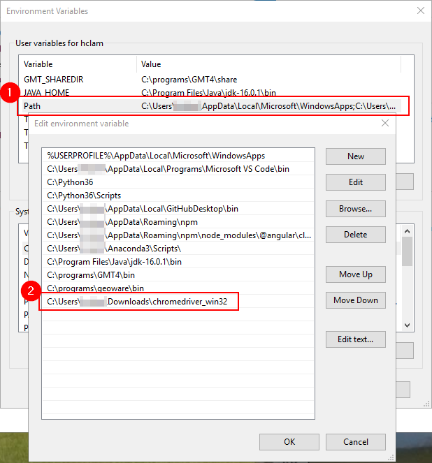
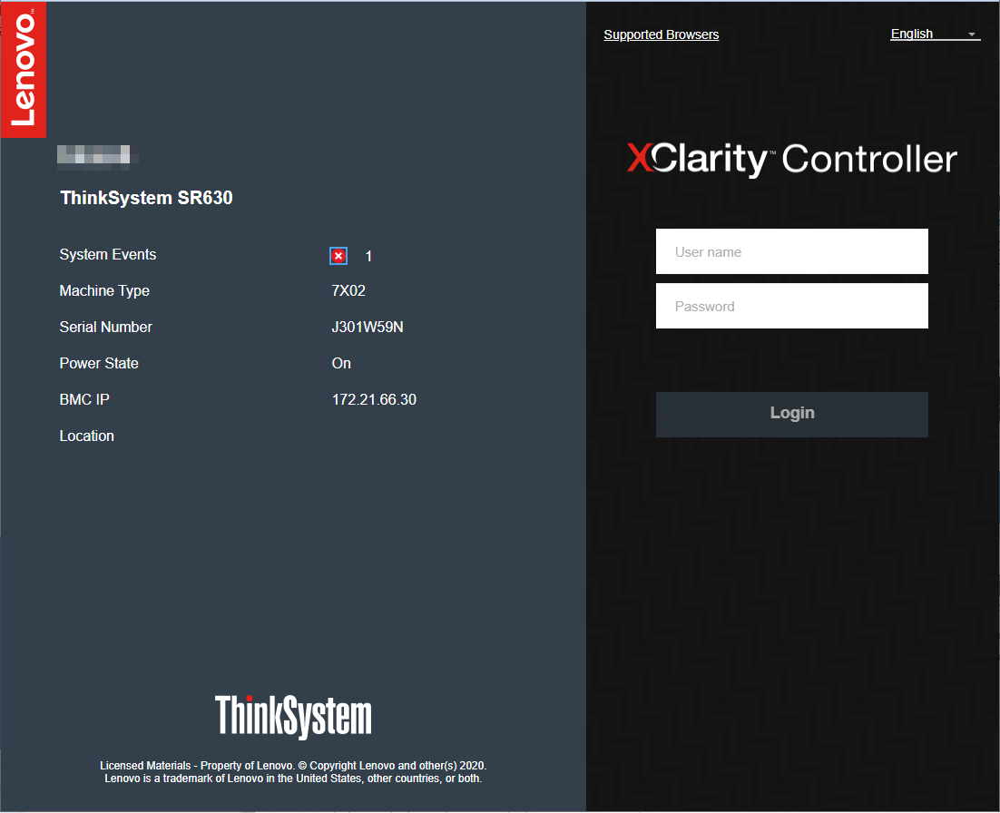
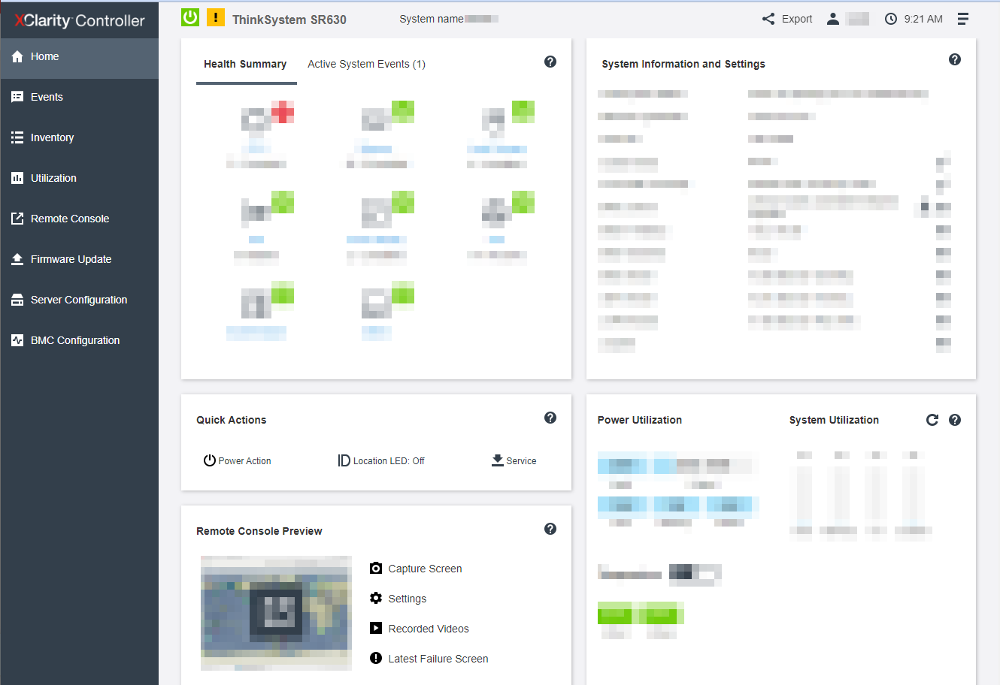
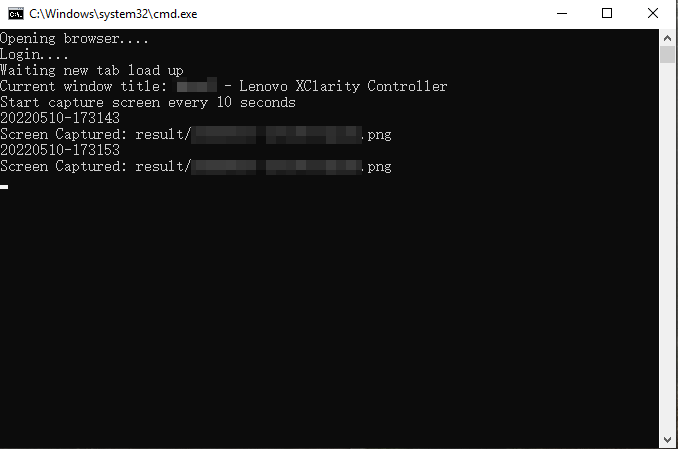

## Auto task with Selenium

This script is a example to capture screen in Lenovo XClarity Controller. When this script started, it will open Lenovo XClarity Controller and login with user provided login information. Then, launch the console and start to capture screen every 10 seconds. 

1. Clone source code 
    ```
    git clone https://github.com/ringolam1025/selenium_screen_capture.git
    ```

1. Install selenium
    ```
    pip install selenium
    ```

1. Download Webdriver (Using [Chrome](https://sites.google.com/a/chromium.org/chromedriver/downloads) in this example)

    > You may download other Webdriver if you want, but modifcation `capture.py` is needed
    >   - [Edge](https://developer.microsoft.com/en-us/microsoft-edge/tools/webdriver/)
    >   - [Firefox](https://github.com/mozilla/geckodriver/releases)
    >   - [Safari](https://webkit.org/blog/6900/webdriver-support-in-safari-10/)

1. Webdriver setting in System Environment 
    

1. Create and edit `config.ini` as below:
    ```
    [Setting]
    serverName=
    url=
    captureSavePath=
    second=
    username=
    password=
    ```

1. Dobule click `runAutoCapture.bat` 


# Screen 
1. Login

    

1. Start remote console

    

1. Running in background

    